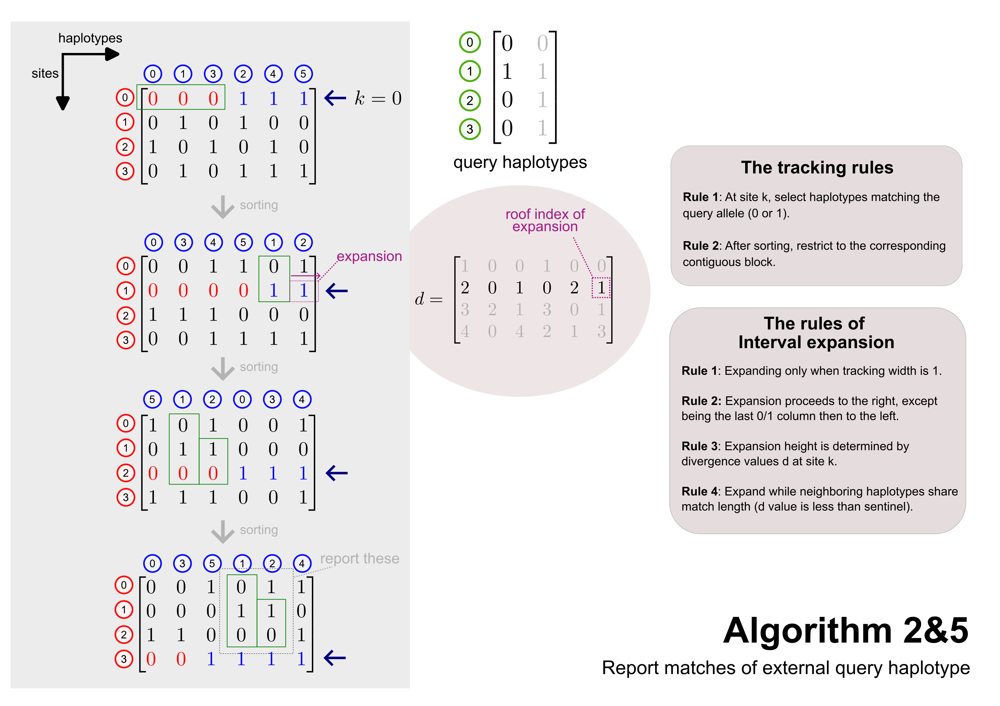

## Introduction

At its core, PBWT relies on sorting haplotypes at each site to reveal local similarities and create connections between related haplotypes. This document describes the first two fundamental algorithms: 

- **Algorithm 1**: The conceptual foundation that builds the **prefix array** by sorting haplotypes based on their reverse prefixes.
- **Algorithm 2**: The primary practical implementation which constructs **both** the **prefix array** and the **divergence array** in a single pass.

## Description

{#algorithm12}

The figure above illustrates the step-by-step process of Algorithms 1 and 2 to construct the **prefix array ($a$)** and the **divergence array ($d$)** from a set of haplotypes.

### Haplotype Matrix and Sorting
Haplotypes are represented as columns, and sites as rows. At each site $k$ (indicated by the **cursor**), we sort the haplotypes based on their genotype values (0 or 1). As shown by the grey arrows, this is a **stable sort**: haplotypes with a `0` at site $k$ are placed before those with a `1`, while their original order is still recognized.

- **The top matrix**: Shows the initial state at site $k=0$.
- **The middle matrix**: Shows the state after sorting at site $k=0$.
- **The bottom matrix**: Shows the state after sorting at site $k=1$.

### Prefix Array ($a$)
The matrix $a$ on the right stores these permutations. Each row $k$ contains the indices of haplotypes in their sorted order at site $k$. For example, the haplotypes (columns) are reordered to $[0, 1, 3, 2, 4, 5]$, forming the first row of the prefix array $a$; and the sort on site 1 reorders the columns to $[0, 3, 4, 5, 1, 2]$, forming the second row of $a$.

### Divergence Array ($d$)
The divergence array $d$ tracks the length of the matching prefix between adjacent haplotypes in the sorted order. Specifically, $d_k[i]$ stores the smallest index $j$ such that haplotype $a_k[i]$ matches $a_k[i-1]$ from site $j$ to site $k$.

- **Purpose boxes**: Highlight the site $j$ that determines the value of $d_k[i]$. If the haplotypes match at the current site $k$ and previous sites, the box marks the start of that match.
- **Mismatch**: If there is no match at the current site $k$, the divergence is $k+1$, and the box is shown one row below the cursor.
- **Sentinels**: For the first haplotype in the sorted order, $d_k[0]$ is set to $k+1$ as a sentinel value.

For example, at $k=1$ (the bottom matrix):

- Haplotype `3` follows `0`. They match at both sites 1 and 0, so $d_1[1] = 0$.
- Haplotype `4` follows `3`. They match at site 1 but differ at site 0. Thus, the match starts at site 1, and $d_1[2] = 1$.
- Haplotype `1` follows `5`. They differ at site 1, so the match is non-existent, and $d_1[4] = k+1 = 2$.

## Conclusion

- **Algorithm 2** is the standard implementation used in practice, as it efficiently computes both the prefix and divergence arrays simultaneously.
- In Richard Durbin's original [source code](https://github.com/richarddurbin/pbwt), Algorithm 1 serves as a conceptual starting point, while Algorithm 2 powers the core functionality for later operations.
- The **divergence array $d$** effectively identifies "chains" of shared segments between haplotypes.
- The **prefix array $a$** enables tracing back and grouping similar haplotypes with high efficiency.
- Both algorithms run in **linear time $O(MN)$**, processing the $M \times N$ genotype matrix in a single pass, making the PBWT highly scalable for massive genomic datasets.
