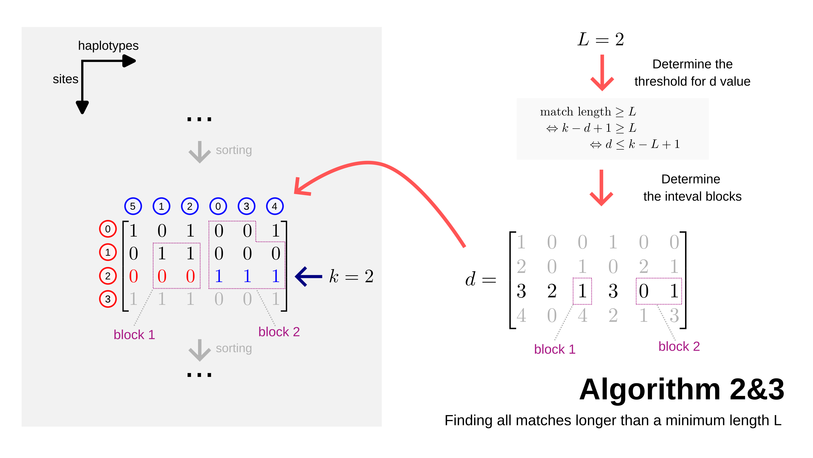

## Introduction

Building upon the prefix and divergence arrays constructed in Algorithm 2, Algorithm 3 provides an efficient way to identify all pairs of haplotypes that share a common segment of at least a minimum length $L$. This is a fundamental operation for detecting Identical-By-Descent (IBD) segments across a population.

## Description

{#algorithm23}

The figure above demonstrates how Algorithm 3 uses the divergence array to find matches that meet the length threshold $L$ at a given site $k$.

### The Match Length Condition
A match between two haplotypes that are adjacent in the sorted order at site $k$ has a length determined by the divergence value $d$. Specifically, if the match starts at site $d$ and ends at site $k$, its length is $k - d + 1$. 

To filter for matches of at least length $L$, we use the condition:
$$k - d + 1 \ge L \iff d \le k - L + 1$$

In the example shown in the figure:

- **Current site**: $k = 2$
- **Minimum length**: $L = 2$
- **Threshold**: $d \le 2 - 2 + 1 = 1$

### Identifying Interval Blocks
Algorithm 3 identifies "interval blocks"—contiguous ranges of haplotypes in the sorted prefix array that share a match. A block $[i, j]$ is formed if for all $m$ from $i+1$ to $j$, the divergence value $d[m]$ is less than or equal to the threshold.

- **Block 1**: At $k=2$, the divergence value $d[2] = 1$ satisfies the threshold ($1 \le 1$). This identifies a match of haplotype at the index 2 (hap 2) to index 1 (hap 1) from site 1 (determined by the d value) to k.
- **Block 2**: The divergence values $d[4] = 0$ and $d[5] = 1$ both satisfy the threshold. This identifies a match block spanning indices 3, 4, and 5 (haplotypes 0, 3, and 4): 
    - The hap 3 matches the hap 0 from site 0 to k.
    - The hap 5 matches the hap 3 from site 1 to k 

### Reporting Matches
When a block is identified, Algorithm 3 reports all pairs within that block as having a match of at least length $L$. In the case of Block 2, this would include matches between (0, 3), (3, 4), and (0, 4).

## Conclusion

- **Efficiency**: Algorithm 3 runs in $O(MN)$ time to find all matches, which is remarkably efficient given that there could be $O(M^2N)$ potential matches in total.
- **Nested Blocks**: The algorithm naturally handles nested matches and overlapping segments by processing the divergence array linearly at each site. 
- **Applications**: This approach is widely used in genetic genealogy and population genetics to find shared ancestry and identify regions of the genome that are conserved within a population.
