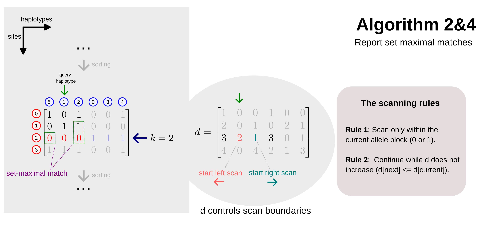

## Introduction

While Algorithm 3 finds all matches longer than a fixed threshold $L$, **Algorithm 4** focuses on identifying **set maximal matches**. "set-maximal matches" is the matches among sorted haplotypes if it cannot be extended further in either direction (to the left or right) without encountering a mismatch.

## Description

{#algorithm24}

The figure above demonstrates how Algorithm 4 uses the **divergence array ($d$)** to control scan boundaries and identify these maximal matches efficiently at a specific site $k$.

### Set maximal matches at site $k$

At any given site $k$, we want to find the longest matches between a haplotype and the others in the database.

In the example:

- **Current site**: $k = 2$.
- **Query haplotype**: The haplotype at position 1 in the sorted order (index 1, the green arrow).
- **Goal**: Find all longest matches of other haplotypes against our query.

### The scanning rules
To find the range of haplotypes sharing a maximal match, Algorithm 4 scans upwards (left) and downwards (right) from the query position in the prefix array. The scan is governed by two critical rules:

1.  **Rule 1: allele block constraint**
    Scan only within the current **allele block**. If our query haplotype has a `0` at site $k$, we only scan other haplotypes that also have a `0` at site $k$. In the figure, this limits the scan to positions 0, 1, and 2.
2.  **Rule 2: divergence control**
    Continue the scan only as long as the divergence value $d$ does not increase: $d[next] \le d[current]$. Since $d[i]$ represents the site where the match between haplotype $i$ and $i-1$ begins, a non-increasing $d$ ensures the match length is at least as long as the initial match being tracked.

### Walking through the example

For the query haplotype at position $i=1$:

- **Divergence values at $k=2$**: $d = [3, 2, 1, 3, 0, 1]$.
- **Left scan**: We look at position 0. $d[1] = 2$, but $d[0] = 3$. Since $3 > 2$, Rule 2 is violated, and the left scan stops.
- **Right scan**: We look at position 2. $d[2] = 1$. Since $1 \le d[1]$ (i.e., $1 \le 2$), Rule 2 is satisfied, and the match extends to the haplotype at position 2. If we tried to go further to position 3, we would hit a `1` at site $k$, violating Rule 1, and also hit $d[3] = 3$, violating Rule 2.

The resulting **set-maximal match** (highlighted in purpose) identifies maximal segment to the current query haplotype.

## Conclusion

- Like the previous algorithms, Algorithm 4 runs in $O(MN)$ time, we do not have go through all other haplotypes everytime to identify matches, making it feasible for a large of haplotype number.